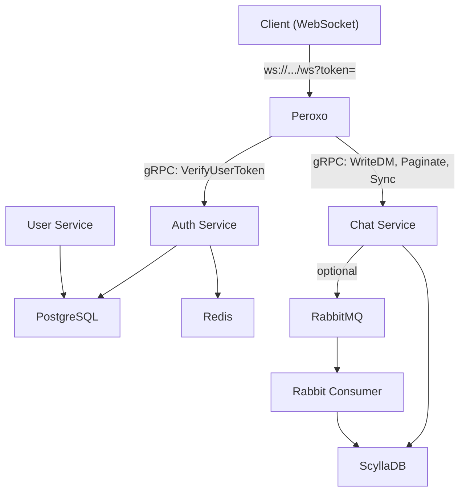
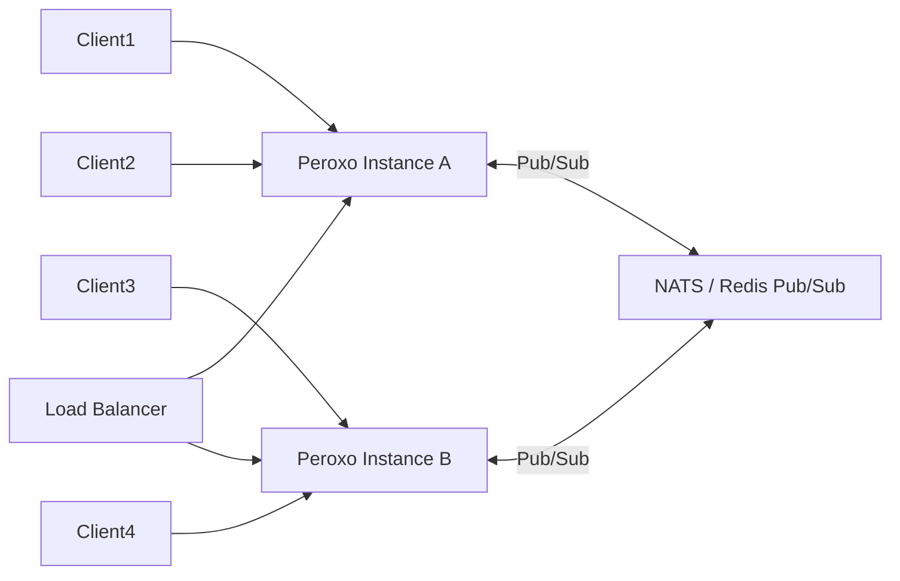

# PerOXO: Performance Improvements and Expansion Roadmap

## Architecture Overview

---

## Part 1: Performance Improvements

### P0 -- Critical Bottlenecks

#### 1. Replace `Vec` with `HashSet` for `online_users` in MessageRouter

Currently `online_users` is a `Vec<TenantUserId>` in `peroxo/src/actors/message_router/router.rs`. Unregistering a user calls `.retain()` which is O(n), and `GetOnlineUsers` clones the entire Vec on every call (line 76 in `peroxo/src/actors/message_router/handlers.rs`). At scale (thousands of users), both operations become expensive.

- Change `online_users: Vec<TenantUserId>` to `HashSet<TenantUserId>` for O(1) insert/remove
- For `GetOnlineUsers`, return a reference-counted snapshot (`Arc<HashSet<...>>`) or a cached Vec that is rebuilt only when the set changes, rather than cloning on every request

#### 2. Unbounded ScyllaDB queries in chat-service

Two queries in `chat-service/src/queries.rs` fetch all rows without a `LIMIT`:

- `fetch_conversation_history` (line 48-72): loads entire conversation history. Add `LIMIT` and cursor-based pagination (the paginated variant already exists at line 75, so this function should either be removed or capped)
- `fetch_user_conversations` (line 28-45): loads all conversations for a user. Add `LIMIT` and pagination

Both use `query_unpaged` which forces all results into memory. For bounded queries, this is acceptable. For potentially unbounded ones, this is a memory risk.

#### 3. Switch auth-service Redis to async

In `auth-service/src/user_token.rs`, lines 49 and 69 call `redis_client.get_connection()` which is **synchronous** and blocks the tokio runtime thread. This is one of the most common Rust async anti-patterns.

- Replace `redis::Client` with `redis::aio::ConnectionManager` (or a multiplexed connection)
- Change `con.set_ex(...)` and `con.get(...)` to their async equivalents via `redis::AsyncCommands`
- This unblocks the tokio worker thread and significantly improves auth throughput under load

#### 4. Fix rabbit_consumer schema mismatch

`rabbit_consumer/src/direct_message.rs` writes to ScyllaDB without `project_id` and uses integer user IDs, but the current schema in chat-service requires `project_id` (text) and text user IDs. This means the RabbitMQ persistence path is completely broken. Either:

- Update rabbit_consumer to match the current schema
- Or remove it if the gRPC persistence path (PersistenceActor) is the primary strategy

---

### P1 -- High-Impact Optimizations

#### 5. Use prepared statements for all frequent queries

Only `fetch_messages_after` uses a prepared statement (via `Queries` struct). All other queries in `chat-service/src/queries.rs` use raw string queries, which means ScyllaDB parses and plans them on every call.

- Prepare all queries at startup in the `Queries` struct (or a similar registry)
- Use `session.execute_unpaged(&prepared, params)` instead of `session.query_unpaged(query_string, params)`
- This eliminates repeated query parsing and can improve latency by 20-40% for high-frequency operations

#### 6. PersistenceActor is a single-threaded bottleneck

The `PersistenceActor` (`peroxo/src/actors/persistance_actor/actor.rs`) processes messages sequentially from a single unbounded channel. Under high message volume, this becomes a chokepoint because:

- Each message triggers a gRPC call that must complete before the next message is processed
- The unbounded channel has no backpressure, so the queue can grow unboundedly

Improvements:

- **Batch writes**: Accumulate messages over a short window (e.g. 10ms or 50 messages) and send them in a single gRPC batch call
- **Shard the actor**: Run N persistence actors (e.g. shard by `conversation_id` hash) to parallelize writes
- **Bounded channel with backpressure**: Switch from `unbounded_channel` to a bounded channel so producers slow down when persistence is behind

#### 7. MessageRouter is a single-point serialization

All WebSocket messages flow through one `MessageRouter` (`peroxo/src/actors/message_router/router.rs`) instance. For high concurrency, this serializes all routing decisions.

- **Shard by tenant/project**: Create one MessageRouter per `project_id` (or hash-shard across N routers)
- **Use `DashMap` instead of single-actor HashMap**: For the user lookup, a concurrent `DashMap<TenantUserId, Sender<ChatMessage>>` avoids the need for single-threaded routing entirely. Direct message delivery can bypass the router for the lookup step.

#### 8. gRPC connection reuse and pooling

In `peroxo/src/connections.rs`, gRPC clients are created at startup. Tonic channels support HTTP/2 multiplexing, but under very high load a single channel can saturate. Consider:

- Using `tonic::transport::Channel::balance_list()` or a load-balanced channel with multiple endpoints
- This becomes essential when scaling chat-service horizontally

#### 9. ScyllaDB consistency tuning

All writes in `chat-service/src/queries.rs` use `Consistency::One`. For a production system:

- Reads can stay at `One` for speed (eventual consistency is acceptable for chat history)
- Writes should use `LocalQuorum` for durability (prevents data loss if a node fails between write and replication)

---

### P2 -- Smaller Wins

#### 10. WebSocket message compression

Enable per-message deflate compression on the WebSocket connection in the Axum upgrade handler. This reduces bandwidth significantly for text-heavy chat messages.

#### 11. Metrics typo fix

In `peroxo/src/metrics.rs` line 159, the label `"peristed"` should be `"persisted"`. This also needs to be updated in `grafana_dashboard.json` to match.

#### 12. Avoid unnecessary clones in message routing

In `peroxo/src/actors/message_router/handlers.rs`, `handle_direct_message` clones `from`, `to`, and `content` for the persistence path. Using `Arc<str>` for message content or restructuring to avoid the clone for the delivery path would reduce allocations.

#### 13. Token validation caching in peroxo

Every WebSocket connection triggers a gRPC call to auth-service for `VerifyUserToken`. Add a short-lived local cache (e.g. `mini-moka` or `dashmap` with TTL) in peroxo to cache recent token verifications for 30-60 seconds. This eliminates redundant gRPC round-trips for reconnecting clients.

#### 14. Enable ScyllaDB connection pooling tuning

The scylla-rust driver defaults are generally good, but explicitly configure:

- `known_nodes` with multiple ScyllaDB nodes (for production clusters)
- `connection_pool_size` based on expected concurrent queries
- `default_consistency` at the session level to avoid repeating it per-query

#### 15. Add resource limits to Docker Compose

No CPU/memory limits are defined for any application service in `docker-compose.yaml`. Add `deploy.resources.limits` to prevent any single service from starving others.

---

## Part 2: Feature Expansion Roadmap

### Tier 1 -- Essential for Production

#### A. Horizontal scaling with cross-instance message routing

Currently, a single peroxo instance holds all WebSocket connections. To scale horizontally:

- Introduce a pub/sub backbone (Redis Pub/Sub, NATS, or Kafka) so that when a message targets a user on a different peroxo instance, it gets forwarded
- Each peroxo instance subscribes to channels for its connected users
- This is the **single most important expansion** for production readiness

#### B. Reverse proxy / API gateway

No reverse proxy exists. Add Traefik or nginx for:

- TLS termination (currently no HTTPS)
- WebSocket load balancing (sticky sessions or connection-aware routing)
- Rate limiting at the edge
- A single entry point for all services

#### C. Offline message delivery and delivery receipts

Currently, if a recipient is offline, the message is persisted but never delivered when they come back. Add:

- A `pending_messages` queue per user in ScyllaDB
- On reconnect, the server pushes undelivered messages (the existing `SyncMessages` gRPC is a start)
- Delivery receipts: `delivered`, `read` status tracked per message

#### D. Rate limiting and abuse prevention

No rate limiting exists anywhere. Add:

- Per-connection message rate limiting in `UserSession` (e.g. 30 messages/sec)
- Per-tenant API rate limiting in auth-service
- Connection rate limiting per IP at the proxy layer

#### E. Comprehensive test suite

Only one test exists (ScyllaDB migration test in chat-service). Add:

- Unit tests for MessageRouter, UserSession, PersistenceActor logic
- Integration tests for the WebSocket flow (connect, send DM, receive DM)
- Load tests using tools like `k6` or `gatling` with WebSocket support
- CI pipeline integration (the current CI only builds Docker images)

---

### Tier 2 -- High-Value Features

#### F. Typing indicators and presence

The actor model already supports it well:

- Add a `TypingStarted` / `TypingStopped` message type to `ChatMessage`
- Broadcast through `MessageRouter` to the other party
- Add proper presence tracking with `last_seen` timestamps stored in Redis

#### G. Message editing, deletion, and reactions

- Add `EditMessage` and `DeleteMessage` message types
- Store edited/deleted state in ScyllaDB (soft delete with tombstone)
- Add a `reactions` column (map type) to `direct_messages` and `room_messages`

#### H. File and media sharing

- Add an object storage backend (S3/MinIO)
- Messages can include `attachment_url` and `attachment_type`
- Upload endpoint with size limits and type validation
- Thumbnail generation for images

#### I. Full-text message search

- Integrate Meilisearch or Elasticsearch
- Index messages on write (via the persistence path or a dedicated consumer)
- Expose a search gRPC endpoint in chat-service
- Scoped per-tenant, per-conversation search

#### J. Push notifications

- For mobile/offline clients, integrate with FCM (Firebase Cloud Messaging) or APNs
- When a message is persisted and the recipient is offline, trigger a push notification
- Configurable per-user notification preferences

---

### Tier 3 -- Advanced / Differentiating

#### K. Multi-device support

- Allow multiple simultaneous connections per `TenantUserId`
- Change `users: HashMap<TenantUserId, Sender>` to `HashMap<TenantUserId, Vec<Sender>>` (or a small `SmallVec`)
- Deliver messages to all active devices

#### L. End-to-end encryption (E2EE)

- Implement the Signal Protocol or similar for DMs
- Server stores only ciphertext; key exchange happens over WebSocket
- Significant complexity, but a strong differentiator for a chat SDK

#### M. Admin dashboard and analytics

- Build a management UI (tenant dashboard) for:
  - Active connections, message throughput, room statistics
  - User management, ban/mute capabilities
  - Grafana is already in the stack; expose dashboards per tenant

#### N. Webhook integrations

- Allow tenants to register webhook URLs for events (new message, user online, etc.)
- Fire-and-forget HTTP POST to webhook URL on relevant events
- Useful for integrating PerOXO into larger applications

#### O. SDK and client libraries

- Build client SDKs (JavaScript/TypeScript, Swift, Kotlin) that handle:
  - WebSocket connection lifecycle, reconnection, token refresh
  - Message queuing during disconnection
  - Typed event handlers
- This is critical for PerOXO to be usable as a third-party chat SDK (aligns with the multi-tenant design)

---

## Summary Priority Matrix

- **Immediate performance wins**: Items 1-4 (async Redis, HashSet, bounded queries, rabbit fix)
- **High-impact optimization**: Items 5-9 (prepared statements, actor sharding, gRPC pooling)
- **Production readiness**: A-E (horizontal scaling, TLS, offline delivery, rate limiting, tests)
- **Feature richness**: F-J (typing, editing, media, search, push)
- **Differentiation**: K-O (multi-device, E2EE, admin, webhooks, SDKs)
